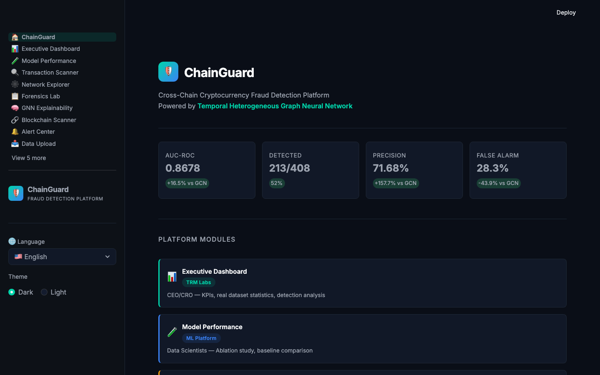
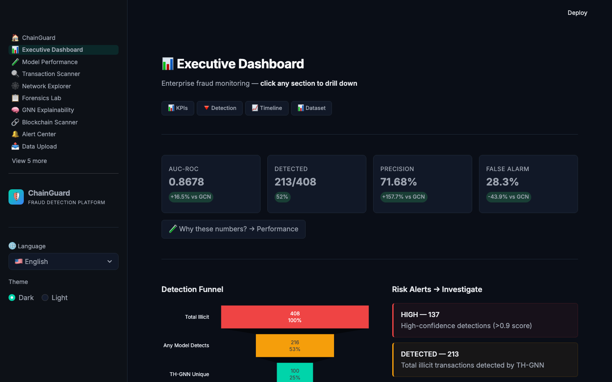
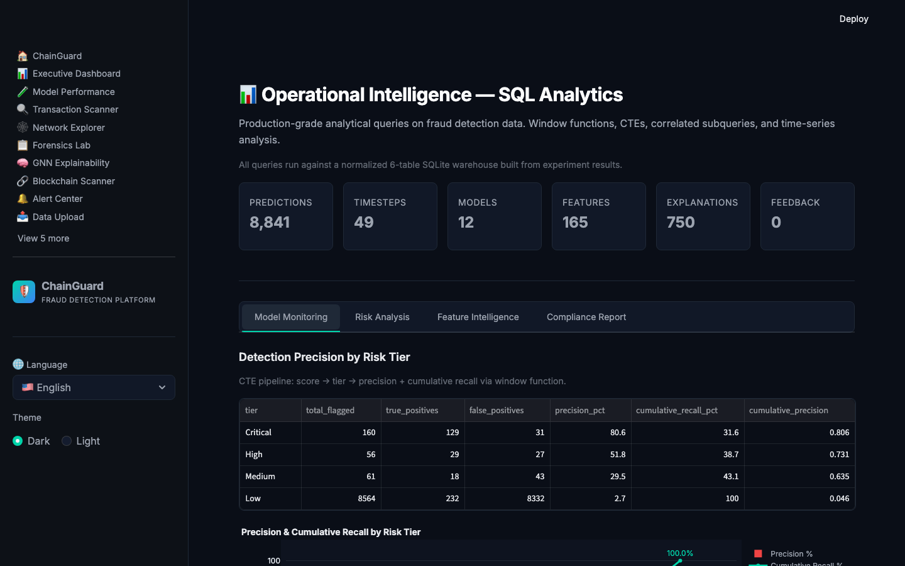
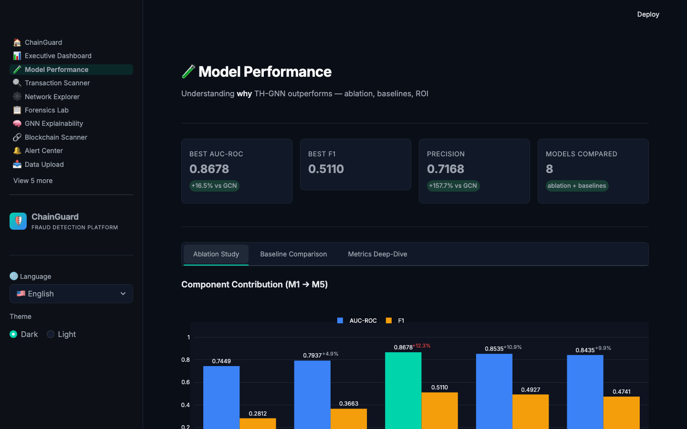
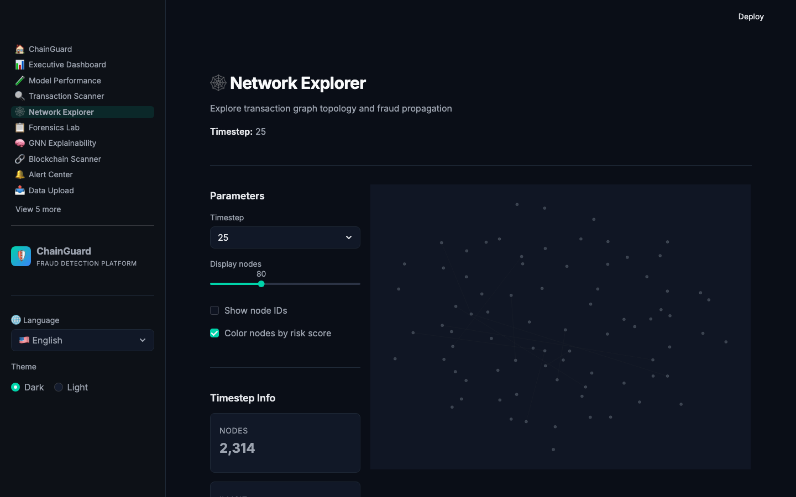
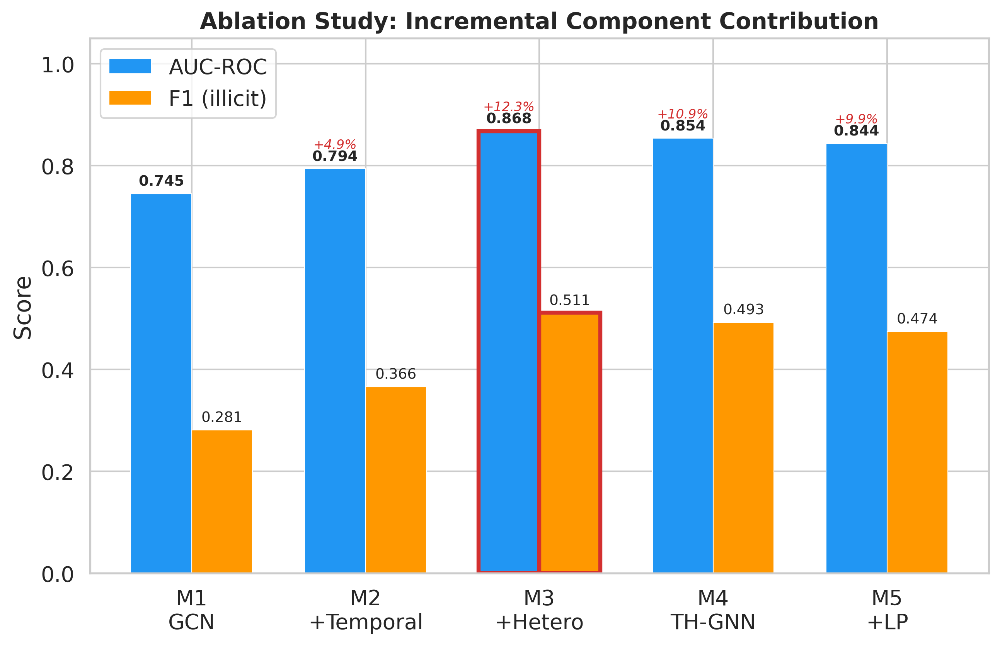
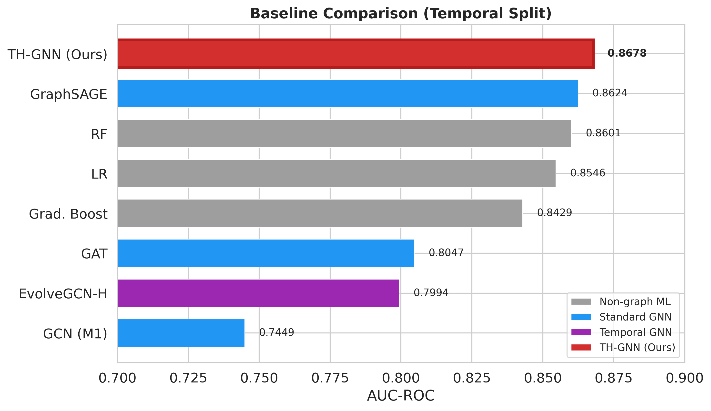
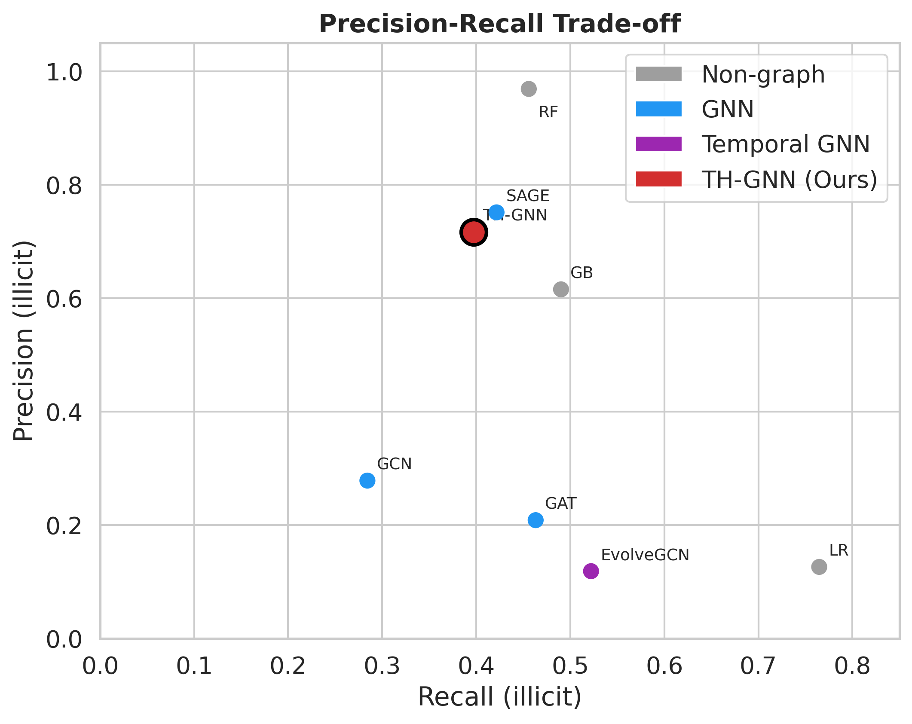

# ChainGuard

### Temporal Heterogeneous Graph Neural Networks for Cross-Chain Cryptocurrency Fraud Detection

[](https://www.python.org/downloads/)
[](https://pytorch.org/)
[](https://streamlit.io/)
[](https://pytest.org/)
[](https://opensource.org/licenses/MIT)

---

## Overview

ChainGuard is an end-to-end fraud detection system for cryptocurrency transactions, combining a **Temporal Heterogeneous Graph Neural Network (TH-GNN)** with a **15-page operational dashboard** and a **production SQL analytics warehouse**.

**Key result:** TH-GNN (M3) achieves **AUC-ROC 0.8678** with **71.68% precision** — a +16.5% AUC improvement and +157.7% precision improvement over the baseline GCN, meaning fewer false alarms per detection for operational teams.

| Component | What It Does |
|-----------|-------------|
| **ML Pipeline** | 5-model ablation study + 8 baselines, trained on 203K Bitcoin nodes across 49 timesteps (Elliptic dataset) |
| **Dashboard** | 15-page Streamlit app with real-time risk scoring, network visualization, case management, and 30-language i18n |
| **SQL Analytics** | 6-table normalized warehouse with 7 advanced analytical queries (window functions, CTEs, correlated subqueries) |
| **Feedback Loop** | Analyst confirm/reject workflow that feeds back into model evaluation via SQLite persistence |

---

## Dashboard Preview

| Home | Executive Dashboard |
|:--:|:--:|
|  |  |

| SQL Analytics | Model Performance |
|:--:|:--:|
|  |  |

| Network Explorer |
|:--:|
|  |

---

## Architecture

```
┌──────────────────────────────────────────────────────────────────┐
│                        DATA LAYER                                │
│                                                                  │
│  Elliptic Bitcoin Dataset    Etherscan Live API    Experiment     │
│  (203K nodes, 49 timesteps)  (block/gas/tx data)  Results JSON   │
└────────┬──────────────────────────┬──────────────────┬───────────┘
         │                          │                  │
         ▼                          ▼                  ▼
┌──────────────────┐  ┌──────────────────┐  ┌──────────────────────┐
│   ML PIPELINE    │  │  LIVE FEED       │  │  ETL PIPELINE        │
│                  │  │                  │  │                      │
│  PyTorch Geometric│  │  Etherscan API   │  │  JSON → SQLite       │
│  R-GCN (hetero)  │  │  Latest blocks   │  │  6 normalized tables │
│  5 ablation models│  │  Gas prices      │  │  FK + CHECK + idx    │
│  8 baselines     │  │  High-value txs  │  │  8,841+ predictions  │
└────────┬─────────┘  └────────┬─────────┘  └──────────┬───────────┘
         │                     │                       │
         ▼                     ▼                       ▼
┌──────────────────────────────────────────────────────────────────┐
│                     STREAMLIT DASHBOARD (15 pages)                │
│                                                                  │
│  Executive Dashboard ─ Model Performance ─ Transaction Scanner   │
│  Network Explorer ─ Forensics Lab ─ GNN Explainability           │
│  Blockchain Scanner ─ Alert Center ─ Case Management             │
│  Data Upload ─ Model Comparison ─ Node Search                    │
│  Activity Log ─ SQL Analytics                                    │
│                                                                  │
│  ┌────────────────────────────────────────────────────────┐      │
│  │  SQLite Persistence Layer                              │      │
│  │  • cases + feedback tables (operational CRUD)          │      │
│  │  • 6-table analytics warehouse (reporting queries)     │      │
│  └────────────────────────────────────────────────────────┘      │
│                                                                  │
│  30 languages · Dark/Light theme · Plotly interactive charts      │
└──────────────────────────────────────────────────────────────────┘
```

---

## Experiment Results

### Ablation Study — Component Contribution

Each model variant isolates one architectural component to measure its marginal contribution:

| Model | Description | AUC-ROC | F1 | Precision | Recall |
|-------|------------|---------|------|-----------|--------|
| M1 | GCN (baseline) | 0.7449 | 0.2812 | 0.2782 | 0.2843 |
| M2 | + Temporal edges | 0.7937 | 0.3663 | 0.4610 | 0.3039 |
| **M3** | **+ Heterogeneous conv** | **0.8678** | **0.5110** | **0.7168** | **0.3971** |
| M4 | Full TH-GNN | 0.8535 | 0.4927 | 0.6131 | 0.4118 |
| M5 | + Label propagation | 0.8435 | 0.4741 | 0.6594 | 0.3701 |

**Finding:** The heterogeneous graph convolution (M3) provides the largest single improvement (+9.3% AUC over M2). Graph structure augmentation matters more than model complexity.

### Baseline Comparison

| Method | Type | AUC-ROC | F1 |
|--------|------|---------|------|
| **TH-GNN (M3)** | **Heterogeneous GNN** | **0.8678** | **0.5110** |
| GraphSAGE | GNN | 0.8624 | 0.5400 |
| Random Forest | Traditional ML | 0.8601 | 0.6200 |
| Logistic Regression | Traditional ML | 0.8546 | 0.2164 |
| Gradient Boosting | Traditional ML | 0.8429 | 0.5457 |
| GAT | GNN (attention) | 0.8283 | 0.5100 |
| GCN (M1) | GNN | 0.7449 | 0.2812 |
| EvolveGCN | Temporal GNN | 0.7101 | 0.4400 |

TH-GNN ranks #1 on AUC-ROC across all 8 methods with the highest precision (71.68%), critical for reducing false alarms in production AML workflows.

### Figures

| Ablation Bar Chart | Baseline Comparison | Precision-Recall Scatter |
|:--:|:--:|:--:|
|  |  |  |

---

## SQL Analytics Warehouse

The dashboard includes a production-grade SQL analytics layer built on a **6-table normalized SQLite schema** with foreign keys, CHECK constraints, generated columns, and composite indexes.

### Schema

| Table | Rows | Purpose |
|-------|------|---------|
| `predictions` | 8,841 | All model-scored nodes with risk scores and ground truth labels |
| `timestep_stats` | 49 | Per-timestep aggregated statistics (risk rate, node counts) |
| `model_results` | 12 | Experiment results from ablation + baseline comparison |
| `feature_importance` | 165 | Gradient-based feature importance scores per model |
| `node_explanations` | 750 | Per-node feature contributions (top 50 nodes) |
| `analyst_feedback` | dynamic | Analyst corrections from the feedback loop |

### Advanced SQL Techniques Demonstrated

| # | Technique | SQL Functions | Business Question |
|---|-----------|--------------|-------------------|
| 1 | **Window Functions** | `RANK()`, `NTILE()`, `LAG()`, `AVG() OVER` | Risk ranking within each timestep |
| 2 | **CTEs** | `WITH ... AS` (3-stage pipeline) | Detection precision by risk tier with cumulative recall |
| 3 | **Multi-table JOINs** | 3-table `JOIN ... ON` | Analyst feedback vs. ground truth outcome classification |
| 4 | **Correlated Subqueries** | `WHERE col > (SELECT ...)` | Model blind spots — illicit nodes scored below timestep average |
| 5 | **Running Aggregation** | `SUM() OVER (ORDER BY ...)` | Feature importance Pareto analysis (80/20 rule) |
| 6 | **Time-Series Analysis** | `LAG()`, moving `AVG`, `CASE` | Risk rate spike detection with 5-period moving average |
| 7 | **Conditional Aggregation** | `GROUP BY`, `HAVING`, `SUM(CASE)` | Model category comparison with scalar subquery |

### Example: Spike Detection Query (Q6)

```sql
WITH trend AS (
    SELECT timestep, risk_rate,
           AVG(risk_rate) OVER (
               ORDER BY timestep
               ROWS BETWEEN 4 PRECEDING AND CURRENT ROW
           ) AS moving_avg_5
    FROM timestep_stats
)
SELECT *,
    CASE
        WHEN risk_rate > moving_avg_5 * 2 THEN 'SPIKE'
        WHEN risk_rate < moving_avg_5 * 0.5 THEN 'DROP'
        ELSE 'NORMAL'
    END AS anomaly_flag
FROM trend
ORDER BY timestep;
```

---

## Dashboard Pages

| Page | Audience | Key Features |
|------|----------|-------------|
| **Executive Dashboard** | CRO, Head of Compliance | Detection funnel, risk timeline, drill-down navigation |
| **Model Performance** | Data Scientists | Ablation bar chart, radar comparison, precision-recall scatter |
| **Transaction Scanner** | Analysts | Multi-layer risk scoring with anti-evasion detection |
| **Network Explorer** | Investigators | Interactive graph visualization, Sankey flow diagram |
| **Forensics Lab** | Investigators | Per-node evidence cards, feature contribution breakdown |
| **GNN Explainability** | Data Scientists | Feature importance, gradient attribution visualization |
| **Blockchain Scanner** | Analysts | Live Etherscan API feed, address/transaction lookup |
| **Alert Center** | Analysts | Risk-ranked alert queue, confirm/FP feedback loop, confusion matrix |
| **Case Management** | Investigators | Investigation ticketing, status tracking, findings log |
| **SQL Analytics** | Data Engineers, Compliance | 7 advanced queries across 4 tabs with interactive charts |
| **Data Upload** | Data Engineers | CSV/JSON import for new transaction data |
| **Model Comparison** | Data Scientists | Side-by-side metric comparison across all models |
| **Node Search** | Analysts | Search and filter nodes by risk score, label, timestep |
| **Activity Log** | All | Audit trail of user actions and system events |

---

## Setup & Run

### Prerequisites

- Python 3.10+
- pip or uv package manager

### Installation

```bash
# Clone the repository
git clone https://github.com/youseihuayu-wonderful/ChainGuard-Crypto-Financial-Fraud-Detection-using-Temporal-Multi-Chain-Graph-Neural-Networks.git
cd ChainGuard-Crypto-Financial-Fraud-Detection-using-Temporal-Multi-Chain-Graph-Neural-Networks

# Create virtual environment
python -m venv .venv
source .venv/bin/activate  # Linux/Mac
# .venv\Scripts\activate   # Windows

# Install dependencies
pip install -r requirements.txt
```

### Run the Dashboard

```bash
streamlit run dashboard/app.py
```

The dashboard starts at `http://localhost:8501` with all 15 pages, SQLite databases auto-initialized on first run.

### Run Tests

```bash
pytest tests/ -v
```

---

## Testing

The test suite validates the SQL analytics warehouse and database CRUD operations:

```
tests/
├── conftest.py              # Shared fixtures (temp databases, sample data)
├── test_analytics_db.py     # 15 tests: schema, ETL, all 7 query functions
└── test_database.py         # 10 tests: CRUD lifecycle, feedback, edge cases
```

**What's tested:**
- Schema validation — all 6 tables exist with correct column structure
- ETL integrity — row counts match source JSON, foreign keys are consistent
- Query correctness — result shapes, value ranges, mathematical invariants (e.g., cumulative percentages are monotonically increasing, Pareto sums reach 100%)
- CRUD lifecycle — save → retrieve → update → retrieve for cases and feedback
- Edge cases — empty database queries, duplicate inserts, feedback stats aggregation

---

## Project Structure

```
chainguard/
├── dashboard/                     # Streamlit dashboard (15 pages)
│   ├── app.py                     # Main app with st.navigation()
│   ├── shared.py                  # Theme, CSS, data loading
│   ├── _lib/                      # Page modules
│   │   ├── home.py                # Home page with KPIs and module cards
│   │   ├── analytics_db.py        # SQL warehouse (6 tables, 7 queries)
│   │   ├── database.py            # SQLite CRUD (cases, feedback)
│   │   ├── sql_analytics.py       # SQL Analytics dashboard page
│   │   ├── executive.py           # Executive Dashboard
│   │   ├── performance.py         # Model Performance
│   │   ├── scanner.py             # Transaction Scanner
│   │   ├── network.py             # Network Explorer
│   │   ├── forensics.py           # Forensics Lab
│   │   ├── explainability.py      # GNN Explainability
│   │   ├── blockchain.py          # Blockchain Scanner + Live Feed
│   │   ├── alerts.py              # Alert Center + Feedback Loop
│   │   ├── case_management.py     # Case Management
│   │   ├── i18n.py                # 30-language translations (593+ keys)
│   │   └── ...                    # Data Upload, Comparison, Search, Activity
│   └── .streamlit/config.toml     # Streamlit configuration
├── src/                           # ML pipeline
│   ├── data/                      # Data loading & graph construction
│   │   ├── elliptic_loader.py     # Elliptic dataset loader
│   │   ├── graph_builder.py       # Multi-chain graph construction
│   │   └── bridge_parser.py       # Cross-chain bridge parser
│   ├── models/                    # Model architectures
│   │   ├── th_gnn.py              # TH-GNN (proposed model)
│   │   ├── hetero_gcn.py          # Heterogeneous GCN (M3)
│   │   ├── temporal_gcn.py        # Temporal GCN (M2)
│   │   ├── baselines/gcn.py       # GCN baseline (M1)
│   │   └── modules/               # Reusable components
│   │       ├── hetero_conv.py     # Heterogeneous message passing
│   │       ├── temporal_attention.py  # Temporal attention
│   │       └── label_propagation.py   # Label propagation (M5)
│   ├── training/                  # Training infrastructure
│   └── evaluation/metrics.py      # AUC, F1, Precision, Recall
├── experiments/
│   ├── results/                   # JSON experiment outputs
│   │   ├── ablation_results.json
│   │   ├── baseline_comparison.json
│   │   ├── m3_predictions.json
│   │   ├── timestep_stats.json
│   │   └── ...
│   ├── scripts/                   # Training scripts (all models)
│   └── saved_models/              # Trained model checkpoints
├── tests/                         # pytest test suite
├── figures/                       # Generated charts (PNG + PDF)
├── paper/                         # LaTeX write-up
├── docs/                          # Research proposals + screenshots
│   └── screenshots/               # Dashboard screenshots for README
├── notebooks/                     # Data exploration
├── requirements.txt               # pip install dependencies
└── pyproject.toml                 # Project config + dependencies
```

---

## Tech Stack

| Category | Tools |
|----------|-------|
| **ML / Deep Learning** | PyTorch, PyTorch Geometric, scikit-learn, XGBoost |
| **Graph Neural Networks** | R-GCN (heterogeneous), temporal attention, label propagation |
| **Dashboard** | Streamlit, Plotly, Pandas |
| **Database** | SQLite (operational CRUD + analytics warehouse) |
| **Data** | NumPy, Pandas, NetworkX |
| **Testing** | pytest |
| **Visualization** | Plotly (interactive), Matplotlib/Seaborn (static figures) |

---

## Documentation

- [English Research Proposal](docs/ChainGuard-Research-Proposal-EN.md)
- [Chinese Research Proposal](docs/ChainGuard-Research-Proposal-CN.md)
- [Experiment Phases](docs/EXPERIMENT_PHASES.md)

---

## License

MIT License

## Citation

```bibtex
@misc{chainguard2026,
  title={ChainGuard: Temporal Heterogeneous Graph Neural Networks for
         Cross-Chain Cryptocurrency Fraud Detection},
  author={Shihua Yu},
  year={2026},
  url={https://github.com/youseihuayu-wonderful/ChainGuard-Crypto-Financial-Fraud-Detection-using-Temporal-Multi-Chain-Graph-Neural-Networks}
}
```
